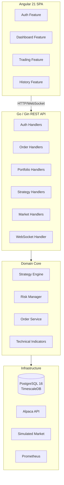

# TradeKai

A production-grade, multi-user algorithmic trading platform built with Go (Gin) and Angular 21.

## Architecture



## Technology Stack

| Layer       | Technology                                 |
|-------------|--------------------------------------------|
| Backend     | Go 1.23, Gin v1.12                         |
| Database    | PostgreSQL 16 + TimescaleDB (hypertables)  |
| ORM / SQL   | sqlc v1.30 (type-safe query generation)    |
| Migrations  | golang-migrate                             |
| Auth        | JWT (golang-jwt/jwt v5) + bcrypt           |
| WebSocket   | gorilla/websocket (room-based pub/sub)     |
| Config      | Viper (`.env` + env vars)                  |
| Logging     | Zap (JSON prod / console dev)              |
| Observability | Prometheus + OpenTelemetry               |
| Frontend    | Angular 21 (standalone + signals)          |
| Charts      | Lightweight Charts (TradingView)           |
| CI          | GitHub Actions                             |
| Deploy      | Docker + docker-compose + nginx            |

## Project Structure

```
TradeKai/
├── backend/
│   ├── cmd/server/          # Entry point, DI wiring, graceful shutdown
│   └── internal/
│       ├── auth/            # JWT manager, service, middleware
│       ├── config/          # Viper config, Zap logger
│       ├── domain/          # Pure domain types & port interfaces (zero external deps)
│       ├── handler/         # Gin HTTP handlers
│       ├── market/          # MarketDataProvider adapters (simulated, Alpaca)
│       ├── middleware/       # CORS, rate-limiter, request-ID
│       ├── order/           # Order service, executors, retry logic
│       ├── risk/            # Pre-trade risk rules & manager
│       ├── store/           # DB migrations, SQL queries, sqlc generated code
│       ├── strategy/        # Technical indicators, strategies, engine
│       └── ws/              # WebSocket hub & client
├── frontend/
│   └── src/app/
│       ├── core/            # Auth service/guard/interceptor, WS service, API service
│       ├── features/        # auth, dashboard, trading, history
│       └── shared/          # Models (Order, Position, Tick)
├── deployments/
│   ├── docker-compose.yml   # Production
│   ├── docker-compose.dev.yml
│   └── nginx/nginx.conf
└── .github/workflows/ci.yml
```

## Quick Start (Development)

### Prerequisites

- Docker & Docker Compose
- Go 1.23+
- Node.js 22+
- [sqlc](https://sqlc.dev/) (`go install github.com/sqlc-dev/sqlc/cmd/sqlc@latest`)
- [golang-migrate CLI](https://github.com/golang-migrate/migrate)

### 1. Environment

```bash
cp .env.example .env
# Edit .env and set JWT_SECRET and optionally ALPACA_API_KEY / ALPACA_API_SECRET
```

### 2. Start Infrastructure

```bash
docker-compose -f deployments/docker-compose.dev.yml up -d postgres
```

### 3. Run Migrations & Generate Code

```bash
cd backend
make migrate-up    # runs all DB migrations
make sqlc          # generates type-safe Go from SQL queries
```

### 4. Start Backend

```bash
cd backend
make run
# Listening on :8080
```

### 5. Start Frontend Dev Server

```bash
cd frontend
npm install
npm start
# Proxies /api/* and /ws to localhost:8080
# Open http://localhost:4200
```

### Full Stack (Docker)

```bash
docker-compose -f deployments/docker-compose.yml up --build
# Open http://localhost
```

## API Reference

Interactive Swagger docs are available at `http://localhost:8080/api/v1/docs/index.html` when the backend is running.

### Key Endpoints

| Method | Path | Description |
|--------|------|-------------|
| POST | `/api/v1/auth/register` | Register a new user |
| POST | `/api/v1/auth/login` | Login, returns JWT token pair |
| POST | `/api/v1/auth/refresh` | Refresh access token |
| GET  | `/api/v1/orders` | List orders (paginated) |
| POST | `/api/v1/orders` | Place a new order |
| DELETE | `/api/v1/orders/:id` | Cancel an order |
| GET  | `/api/v1/portfolio/positions` | Open positions |
| GET  | `/api/v1/portfolio/pnl` | Daily realized P&L |
| GET  | `/api/v1/market/candles/:symbol` | OHLCV candles |
| GET  | `/api/v1/strategies` | List configured strategies |
| POST | `/api/v1/strategies/:name/start` | Start a strategy |
| POST | `/api/v1/strategies/:name/stop` | Stop a strategy |
| GET  | `/ws` | WebSocket connection (requires `?token=<access_token>`) |

## WebSocket Protocol

Connect with `?token=<JWT>`. Send JSON messages to subscribe/unsubscribe:

```json
{ "action": "subscribe",   "room": "ticks:AAPL" }
{ "action": "unsubscribe", "room": "ticks:AAPL" }
```

Rooms: `ticks:<SYMBOL>`, `orders:<USER_ID>`

Server broadcasts:
```json
{ "type": "tick",         "payload": { "symbol": "AAPL", "price": 193.44, "ts": "..." } }
{ "type": "order_update", "payload": { "id": "...", "status": "filled", ... } }
```

## Configuration

All settings are loaded from a `.env` file (see `.env.example`). Key variables:

| Variable | Default | Description |
|----------|---------|-------------|
| `DATABASE_URL` | — | PostgreSQL connection string (required) |
| `JWT_SECRET` | — | Secret key for JWT signing (required, min 32 chars) |
| `MARKET_PROVIDER` | `simulated` | `simulated` or `alpaca` |
| `ORDER_PROVIDER` | `simulated` | `simulated` or `alpaca` |
| `ALPACA_API_KEY` | — | Alpaca paper-trading key |
| `ALPACA_API_SECRET` | — | Alpaca paper-trading secret |
| `RISK_MAX_POSITION_SIZE` | `10000` | Max $ per position |
| `RISK_DAILY_LOSS_LIMIT` | `5000` | Max daily loss before trading halts |
| `SERVER_PORT` | `8080` | HTTP listen port |
| `LOG_LEVEL` | `info` | `debug` / `info` / `warn` / `error` |
| `LOG_ENV` | `development` | `development` (console) or `production` (JSON) |

## Running Tests

```bash
# Backend unit tests
cd backend && make test

# Backend with race detector
cd backend && go test -race ./...

# Frontend unit tests
cd frontend && npm test

# Frontend with coverage
cd frontend && npm run test -- --code-coverage
```

## License

MIT
