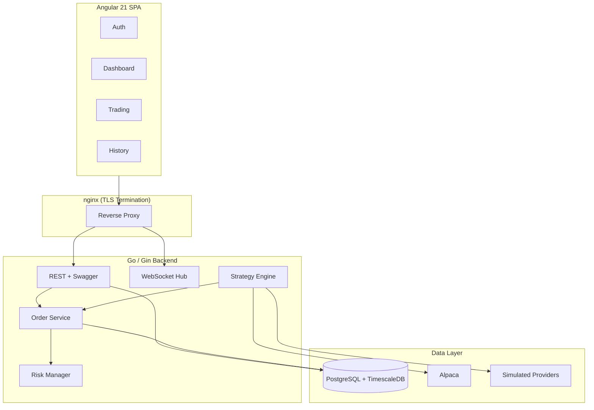
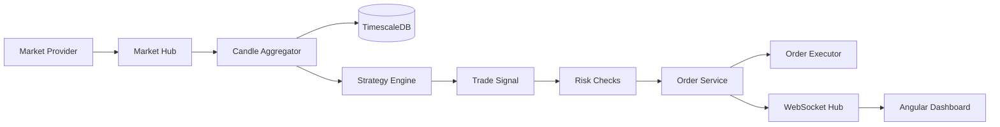

# TradeKai

TradeKai is a real-time algorithmic trading platform built as a production-style portfolio project using Go (Gin), Angular 21, PostgreSQL/TimescaleDB, WebSockets, and Docker.

## Why This Project

- Demonstrates end-to-end system design across backend, frontend, database, infrastructure, and CI.
- Uses clean architecture boundaries and interface-driven adapters for maintainability.
- Implements real-time market streams, strategy evaluation, risk checks, and order lifecycle tracking.
- Includes production-hardening patterns: health checks, metrics, rate limiting, TLS-ready reverse proxy, and integration tests.

## What You Can Demo Quickly

1. Register and login via REST API.
2. Open dashboard and watch real-time market updates.
3. Start a strategy and observe emitted signals.
4. Place manual orders and watch order updates over WebSocket.
5. Show system health and metrics endpoints.

## Architecture

### System Overview



### Event Pipeline



## Technology Stack

| Layer       | Technology                        |
| ----------- | --------------------------------- |
| Backend     | Go 1.23, Gin                      |
| Database    | PostgreSQL 16 + TimescaleDB       |
| Query layer | sqlc                              |
| Auth        | JWT + bcrypt                      |
| Realtime    | gorilla/websocket                 |
| Logging     | Zap                               |
| Metrics     | Prometheus                        |
| Frontend    | Angular 21 (standalone + signals) |
| Charts      | Lightweight Charts (TradingView)  |
| Deployment  | Docker, docker compose, nginx     |
| CI          | GitHub Actions                    |

## Quick Start (Development)

### Prerequisites

- Docker Desktop (with Compose)
- Go 1.23+
- Node.js 22+
- `sqlc` CLI
- `migrate` CLI

### 1) Configure environment

```bash
cp .env.example .env
```

Set at minimum:

- `DATABASE_URL`
- `JWT_SECRET` (32+ characters)

### 2) Start database

```bash
docker compose -f deployments/docker-compose.yml -f deployments/docker-compose.dev.yml up -d db
```

This uses the production compose baseline plus the development override.

### 3) Run migrations and SQL generation

```bash
cd backend
make migrate-up
make sqlc-generate
```

Note: `migrate-up` uses `DATABASE_URL` from your environment or `.env`.

### 4) Start backend

```bash
cd backend
make run
```

Backend runs on `http://localhost:8080` in dev.

### 5) Start frontend

```bash
cd frontend
npm install
npm start
```

Frontend runs on `http://localhost:4200` and proxies `/api` and `/ws` to backend.

## Production Deployment

### Run full stack

```bash
docker compose -f deployments/docker-compose.yml up --build -d
```

Public entrypoint is nginx on:

- `http://localhost` (redirects to HTTPS)
- `https://localhost`

### TLS certificate setup

nginx expects cert files in `deployments/nginx/certs`:

- `fullchain.pem`
- `privkey.pem`

For local/demo usage, place self-signed certs there.
For Let's Encrypt, use ACME challenge path mounted at `deployments/nginx/certbot`.

If certificates are not present, nginx TLS listener will fail to start by design.

### Production configuration defaults

The production compose file sets hardened defaults for:

- `SERVER_MODE=production`
- `LOG_FORMAT=json`
- stricter CORS origin default
- higher DB pool and rate-limit defaults

Override these through `.env` in your target environment.

Recommended minimum production checklist:

1. Set a strong `JWT_SECRET` (32+ chars).
2. Set `CORS_ALLOWED_ORIGINS` to your real frontend domain.
3. Use valid TLS certs in `deployments/nginx/certs`.
4. Confirm DB persistence volume backup policy.
5. Keep metrics endpoint restricted to trusted networks.

## API Documentation

Swagger UI:

- direct backend: `http://localhost:8080/api/v1/docs/index.html`
- via nginx: `https://localhost/api/v1/docs/index.html`

Health and metrics:

- `GET /api/v1/health`
- `GET /metrics` (network-restricted in nginx)

Health output includes database status, exchange connectivity snapshot, and memory stats.

## Key Endpoints

| Method | Path                             | Description        |
| ------ | -------------------------------- | ------------------ |
| POST   | `/api/v1/auth/register`          | Register user      |
| POST   | `/api/v1/auth/login`             | Login              |
| POST   | `/api/v1/auth/refresh`           | Refresh token      |
| GET    | `/api/v1/market/candles/:symbol` | Historical candles |
| POST   | `/api/v1/orders`                 | Place order        |
| GET    | `/api/v1/orders`                 | List orders        |
| DELETE | `/api/v1/orders/:id`             | Cancel order       |
| GET    | `/api/v1/portfolio/positions`    | Open positions     |
| GET    | `/api/v1/portfolio/pnl`          | PnL summary        |
| GET    | `/api/v1/strategies`             | Strategies list    |
| POST   | `/api/v1/strategies/:id/start`   | Start strategy     |
| POST   | `/api/v1/strategies/:id/stop`    | Stop strategy      |
| GET    | `/ws`                            | WebSocket session  |

## WebSocket Protocol

Connection auth (browser clients):

```js
const ws = new WebSocket("wss://localhost/ws", [
    "tradekai.v1",
    "access-token.<access_token>",
]);
```

Subscribe/unsubscribe payloads:

```json
{ "action": "subscribe", "room": "ticks:AAPL" }
{ "action": "unsubscribe", "room": "ticks:AAPL" }
```

Room examples:

- `ticks:AAPL`
- `orders:<user_id>`

Message examples:

```json
{ "type": "tick", "payload": { "symbol": "AAPL", "price": 193.44 } }
{ "type": "order_update", "payload": { "id": "...", "status": "submitted" } }
```

## Configuration Reference

Key backend environment variables:

| Variable                   | Description                               |
| -------------------------- | ----------------------------------------- |
| `SERVER_MODE`              | `development`, `staging`, or `production` |
| `DATABASE_URL`             | PostgreSQL connection string              |
| `DATABASE_MAX_CONNECTIONS` | DB pool max size                          |
| `DATABASE_MIN_CONNECTIONS` | DB pool min size                          |
| `JWT_SECRET`               | JWT signing secret (required, 32+ chars)  |
| `JWT_ACCESS_TTL`           | Access token TTL                          |
| `JWT_REFRESH_TTL`          | Refresh token TTL                         |
| `CORS_ALLOWED_ORIGINS`     | Comma-separated allowed origins           |
| `RATE_LIMIT_API`           | API requests per minute per client        |
| `RATE_LIMIT_AUTH`          | Auth requests per minute per client       |
| `MARKET_DATA_PROVIDER`     | `simulated` or `alpaca`                   |
| `ORDER_EXECUTOR`           | `simulated` or `alpaca`                   |

See `.env.example` for full list and sample production overrides.

## Testing and CI

### Backend

```bash
cd backend
go test ./...
go test -tags=integration ./internal/integration/...
```

### Frontend

```bash
cd frontend
npm test
npm run build -- --configuration production
```

GitHub Actions workflow in `.github/workflows/ci.yml` runs lint, tests, integration tests, and image builds.

CI pipeline highlights:

- Backend lint + unit tests + integration tests.
- Frontend lint + tests + production build.
- Docker image build verification for backend and frontend.

## Screenshots

Add dashboard screenshots here as the UI evolves:

- Login screen
- Dashboard (chart + positions + PnL)
- Trading controls and signal log

Recommended path convention:

- `deployments/screenshots/login.png`
- `deployments/screenshots/dashboard.png`
- `deployments/screenshots/trading.png`

Include these in portfolio submissions to make the project easy to evaluate quickly.

## Key Technical Decisions

- Gin over Fiber: standard library `net/http` ergonomics and familiarity.
- sqlc over ORM: explicit SQL, type-safe generated queries, better control for time-series use cases.
- TimescaleDB: hypertables and compression for market data workloads.
- Modular monolith: clear internal boundaries with lower operational overhead.
- Simulated providers: local development without mandatory exchange credentials.

## Performance Characteristics

- Market fan-out uses buffered channels and drop-oldest behavior to prevent slow-consumer backpressure.
- Strategy execution uses bounded worker-style concurrency with channel-based signal flow.
- DB access uses pooled pgx connections with configurable min/max bounds.
- Order execution includes retry with bounded attempts to avoid unbounded latency growth.
- WebSocket handling uses dedicated read/write pumps per client with heartbeat.

## Trade-offs and Future Work

- Backtesting engine for historical replay and strategy benchmarking.
- Multi-exchange adapters beyond Alpaca.
- Optional message bus if moving from modular monolith to distributed services.

## License

MIT
